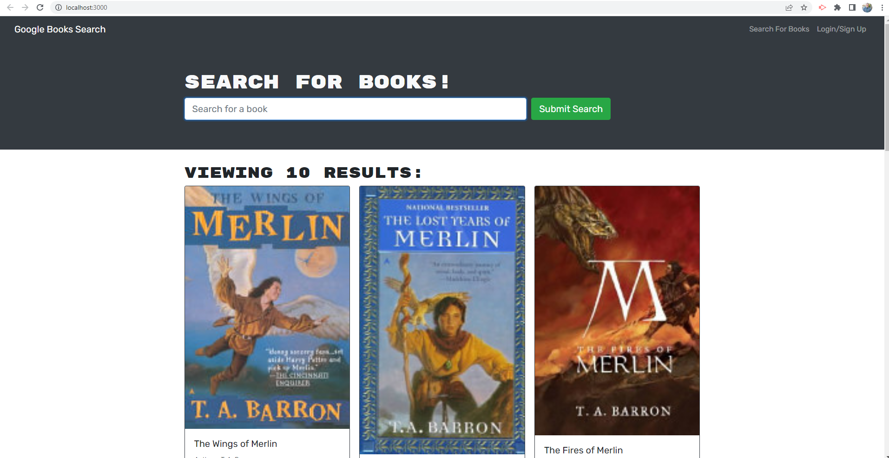

# Book Search Engine refactored built using ```MERN``` !

## Description

Most modern websites are driven by two things: data and user demands. This shouldn't come as a surprise, as the ability to personalize user data is the cornerstone of real-world web development today. And as user demands evolve, applications need to be more performant.

Here I have taken a fully functioning Google Books API search engine built with a RESTful API, and refactored it to be a GraphQL API built with Apollo Server.

Have a look at the deployed Web App through Heroku [HERE](https://book-search-engine-refactored.herokuapp.com/).
## Table of Contents

- [Installation](#installation)
- [Usage](#usage)
- [Credits](#credits)
- [License](#license)
- [Contact Me](#ContactMe)

## Installation

### Run ```npm run develop``` from the top directory.

Runs the app in the development mode.\
Open [http://localhost:3001/graphql](http://localhost:3001/graphql) to view it the Apollo Sandbox, in your browser.

## Usage

To use this repo, go to the repo and clone the files, then open the cloned files in VS Code, be sure you’re in the correct directory in your terminal, then type ```npm install``` wait a moment for it to finsih, then type ```npm run develop``` in your command line. Note: you may need to run ```npm run seed``` and ```npm run build``` first.



## Credits

Collaborators:
I started with fully cuntional code and refactored it myself with help from google, my instructor [Robbert Wijtman](https://github.com/Bucky24), and my reliable tutor Dru Sanchez (contact him via email at asanchez@bootcampspot.com).

## License

MIT License

Copyright (c) [year] [Raymond Robinson]

Permission is hereby granted, free of charge, to any person obtaining a copy
of this software and associated documentation files (the "Software"), to deal
in the Software without restriction, including without limitation the rights
to use, copy, modify, merge, publish, distribute, sublicense, and/or sell
copies of the Software, and to permit persons to whom the Software is
furnished to do so, subject to the following conditions:

The above copyright notice and this permission notice shall be included in all
copies or substantial portions of the Software.

THE SOFTWARE IS PROVIDED "AS IS", WITHOUT WARRANTY OF ANY KIND, EXPRESS OR
IMPLIED, INCLUDING BUT NOT LIMITED TO THE WARRANTIES OF MERCHANTABILITY,
FITNESS FOR A PARTICULAR PURPOSE AND NONINFRINGEMENT. IN NO EVENT SHALL THE
AUTHORS OR COPYRIGHT HOLDERS BE LIABLE FOR ANY CLAIM, DAMAGES OR OTHER
LIABILITY, WHETHER IN AN ACTION OF CONTRACT, TORT OR OTHERWISE, ARISING FROM,
OUT OF OR IN CONNECTION WITH THE SOFTWARE OR THE USE OR OTHER DEALINGS IN THE
SOFTWARE.

---
## ContactMe

- Ray Robinson @ https://Github.com/RayR124 or email me at RealtorRayR@Gmail.com if you have any comments, thoughts, or suggestions.
